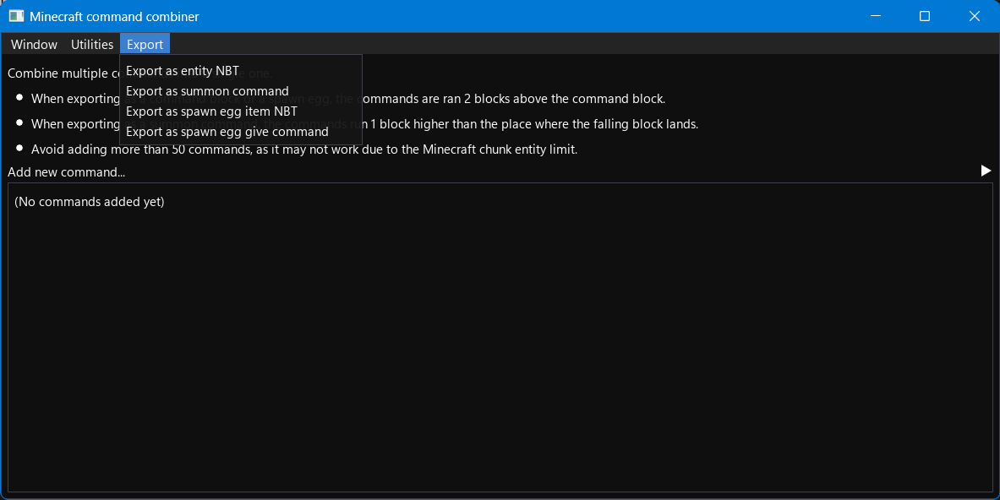

# Minecraft command combiner
Simple Minecraft command combiner written in Python, works on 1.19.2 and newer versions of Minecraft.

## Setup
You will need to have Python 3 installed on your computer. To install the required packages, run the following command:
```
python3 -m pip install -r requirements.txt
```
Where `python3` is the name of or a full path to your Python interpreter.

## Running the program
You need to run the `ui.py` file.

## Screenshot
